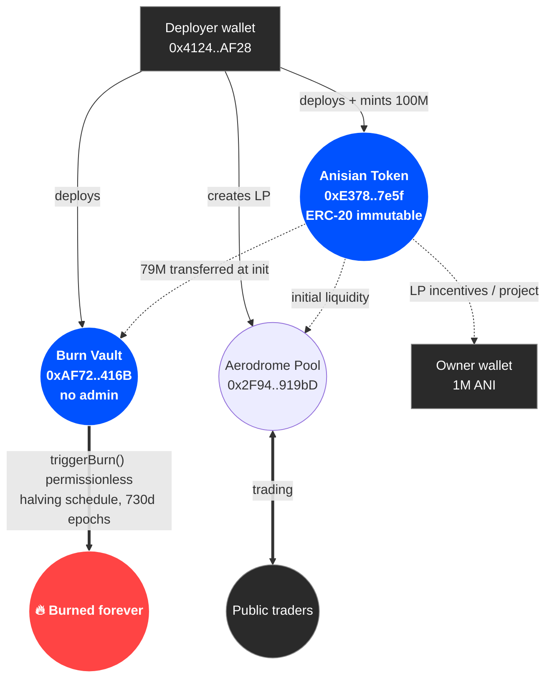

<div align="center">


# Anisian (ANI)

**Fixed-supply, immutable ERC-20 token on Base with a deflationary halving burn schedule.**

[](https://soliditylang.org/)
[](./LICENSE)
[](https://base.org)
[](https://basescan.org/token/0xE378841a3970FD43ac8aD4D1D77b068C87287e5f#code)
[](#project-status-community-owned-no-maintainer)
[](#project-status-community-owned-no-maintainer)
[](https://aerodrome.finance/swap?from=eth&to=0xE378841a3970FD43ac8aD4D1D77b068C87287e5f)

[**Buy on Aerodrome**](https://aerodrome.finance/swap?from=eth&to=0xE378841a3970FD43ac8aD4D1D77b068C87287e5f) · [**View on Basescan**](https://basescan.org/token/0xE378841a3970FD43ac8aD4D1D77b068C87287e5f) · [**Token List**](./tokenlist.json) · [**FAQ**](./docs/FAQ.md)

</div>

---

## Table of contents

- [Overview](#overview)
- [On-chain addresses](#on-chain-addresses-base-mainnet-chainid-8453)
- [System architecture](#system-architecture)
- [Supply distribution](#supply-distribution-100000000-ani-total)
- [Project status: community-owned, no maintainer](#project-status-community-owned-no-maintainer)
- [Add ANI to your wallet](#add-ani-to-your-wallet)
- [Repository layout](#repository-layout)
- [Contract summary](#contract-summary)
- [Build / verify](#build--verify)
- [Documentation](#documentation)
- [License](#license)

---

## Overview

- **100,000,000 ANI** minted once at deployment.
- **~79,000,000 ANI** scheduled to be burned over **~14 years** via a permissionless burn vault (`triggerBurn` callable by anyone).
- **No admin, no mint, no pause, no upgrade proxy.** Once deployed, nobody — not even the deployer — can change the rules.

> Wallets are recommended to fetch token information from this repository or the official explorer pages linked below.

---

## On-chain addresses (Base mainnet, chainId `8453`)

| Role | Address |
| --- | --- |
| ANI token | [`0xE378841a3970FD43ac8aD4D1D77b068C87287e5f`](https://basescan.org/token/0xE378841a3970FD43ac8aD4D1D77b068C87287e5f) |
| Burn vault | [`0xAF727167448374f73AE22e3d026D11965EDf416B`](https://basescan.org/address/0xAF727167448374f73AE22e3d026D11965EDf416B) |
| Liquidity pool | [`0x2F947691C97244D845B2db2f86489D21c4c919bD`](https://basescan.org/address/0x2F947691C97244D845B2db2f86489D21c4c919bD) |
| Owner wallet (limit-exempt) | [`0x412462Ff8E3A3cB96B0b2255114Bd85cC900AF28`](https://basescan.org/address/0x412462Ff8E3A3cB96B0b2255114Bd85cC900AF28) |

Contracts are verified on Basescan — source code matches this repository exactly.

---

## System architecture



See [`docs/ARCHITECTURE.md`](./docs/ARCHITECTURE.md) for a complete description of the system and trust model.

---

## Supply distribution (100,000,000 ANI total)

| Allocation | Amount | Held by |
| --- | --- | --- |
| Burn vault (halving schedule, ~14 years) | 79,000,000 ANI | [`0xAF72..416B`](https://basescan.org/address/0xAF727167448374f73AE22e3d026D11965EDf416B) |
| Initial liquidity (Aerodrome pool) | held in LP | [`0x2F94..919bD`](https://basescan.org/address/0x2F947691C97244D845B2db2f86489D21c4c919bD) |
| LP incentives (Aerodrome liquidity providers) | 700,000 ANI | [`0x4124..AF28`](https://basescan.org/address/0x412462Ff8E3A3cB96B0b2255114Bd85cC900AF28) |
| Deployer / project | 300,000 ANI | [`0x4124..AF28`](https://basescan.org/address/0x412462Ff8E3A3cB96B0b2255114Bd85cC900AF28) |

The 700,000 ANI on the deployer wallet are earmarked to be distributed to **Aerodrome liquidity providers** as a one-time incentive for bootstrapping liquidity. Once distributed, the deployer wallet retains only the 300,000 ANI personal allocation. All balances are publicly verifiable on Basescan.

See [`docs/BURN_SCHEDULE.md`](./docs/BURN_SCHEDULE.md) for the full per-epoch burn allocation table.

---

## Project status: community-owned, no maintainer

Anisian is **immutable by design**:

- The token contract has **no owner, no admin, no mint, no pause, no upgrade**. Nothing in the protocol can be changed by anyone — including the deployer.
- The burn vault has **no admin** and `triggerBurn()` is **permissionless** — anyone may call it on schedule.
- This repository is published as a public reference. There is no required maintainer; the protocol runs without one.

This repo, the logos, and the metadata are released for the community to **use, mirror, pin, fork, and submit to any wallet directory without permission**. See [`CONTRIBUTING.md`](./CONTRIBUTING.md) for ideas.

---

## Add ANI to your wallet

Most wallets (MetaMask, Rabby, Coinbase Wallet, Trust Wallet, …) can add ANI by **contract address**:

1. Open your wallet → *Import token* / *Add custom token*.
2. Network: **Base**.
3. Contract address: `0xE378841a3970FD43ac8aD4D1D77b068C87287e5f`
4. Symbol: `ANI` — Decimals: `18` (auto-filled from the contract).

### Token Lists (DEX wallets, aggregators)

Wallets and DEX UIs that support the [Uniswap Token List](https://tokenlists.org) standard can import this list directly:

```
https://raw.githubusercontent.com/anisiananifree/anisian_contracts/main/tokenlist.json
```

---

## Repository layout

```
.
├── contracts/
│   ├── Anisian.sol              # ERC-20 token (100M fixed supply, launch protection)
│   ├── AnisianBurnVault.sol     # Halving burn schedule, permissionless triggerBurn
│   └── interfaces/IAnisian.sol
├── docs/
│   ├── ARCHITECTURE.md          # System overview, components, trust model
│   ├── BURN_SCHEDULE.md         # Per-epoch burn allocation table
│   └── FAQ.md                   # Common questions
├── ipfs/
│   ├── ani-logo-{128,256,512}.png
│   ├── ani-logo-512-white-bg.png
│   └── token-metadata.json      # ERC-20 metadata (also pinned on IPFS)
├── scripts/
│   ├── README.md
│   └── check-burn-progress.sh   # Query current burn vault state via Base RPC
├── .github/
│   ├── ISSUE_TEMPLATE/
│   ├── PULL_REQUEST_TEMPLATE.md
│   └── FUNDING.yml
├── tokenlist.json               # Uniswap Token List (importable URL)
├── info.json                    # Short project descriptor (Trust Wallet schema)
├── deploy-addresses.txt         # Deployed addresses
├── .remix/settings.json         # Compiler config (0.8.24, runs=200, evm=cancun, viaIR=false)
├── .editorconfig
├── .gitignore
├── CHANGELOG.md
├── CONTRIBUTING.md
├── SECURITY.md
├── LICENSE                      # MIT
└── README.md
```

---

## Contract summary

### `Anisian.sol`

- ERC-20 (`name = "Anisian"`, `symbol = "ANI"`, `decimals = 18`).
- `constructor()` mints `INITIAL_SUPPLY = 100_000_000 ether` to the deployer. No further minting exists.
- `initialize(vault, pool, ownerWallet)` — **one-time** setup callable only by the deployer:
  - Registers the burn vault.
  - Registers the single liquidity pool.
  - Marks `vault` and `ownerWallet` as limit-exempt.
  - Starts the 90-day launch-protection window.
- `burnFromVault(amount)` — only the registered burn vault can call this; it burns ANI from the vault balance.
- **Launch protection** (90 days from `initialize`, applies only to **buys from the registered LP pool**):
  - `MAX_BUY_AMOUNT = 10_000 ANI` per pool buy.
  - `MAX_WALLET_AMOUNT = 20_000 ANI` post-buy balance cap.
  - `BUY_COOLDOWN = 10 minutes` between pool buys per recipient.
  - After 90 days, limits permanently disable on the first transfer (`limitsFinalized = true`). Wallet-to-wallet transfers are never limited.

### `AnisianBurnVault.sol`

- Holds ANI for the scheduled burn.
- `TOTAL_BURN_BUDGET = 79_000_000 ANI`.
- `HALVING_PERIOD = 730 days` (2 years). Period 0 allocates 40M, each subsequent period halves (20M, 10M, 5M, …) until the budget is exhausted.
- `triggerBurn()` — **permissionless**; anyone may call. Burns up to `pendingBurn()` based on the linear-within-period schedule.
- No admin, no withdrawal, no pause.

### `interfaces/IAnisian.sol`

Minimal interface used by the vault (`burnFromVault`, `balanceOf`).

---

## Build / verify

The contracts compile in [Remix](https://remix.ethereum.org) with the settings in `.remix/settings.json`:

- Compiler: **Solidity 0.8.24**
- Optimizer: **enabled**, runs = **200**
- EVM version: **cancun**
- `viaIR`: **false**
- Imports: OpenZeppelin Contracts **v5.2.0** (`ERC20.sol`) via the in-source GitHub URL.

The verified source on Basescan matches the files in `contracts/` byte-for-byte.

To check the current burn progress from your terminal:

```bash
./scripts/check-burn-progress.sh
```

---

## Documentation

- [`docs/ARCHITECTURE.md`](./docs/ARCHITECTURE.md) — system architecture, components, and trust model.
- [`docs/BURN_SCHEDULE.md`](./docs/BURN_SCHEDULE.md) — per-epoch burn schedule and math.
- [`docs/FAQ.md`](./docs/FAQ.md) — common questions about ANI.
- [`SECURITY.md`](./SECURITY.md) — security model and disclosure policy.
- [`CONTRIBUTING.md`](./CONTRIBUTING.md) — how the community can help.
- [`CHANGELOG.md`](./CHANGELOG.md) — versioned project history.

---

## License

[MIT](./LICENSE) — see file. The contracts themselves carry an `SPDX-License-Identifier: MIT` header.
