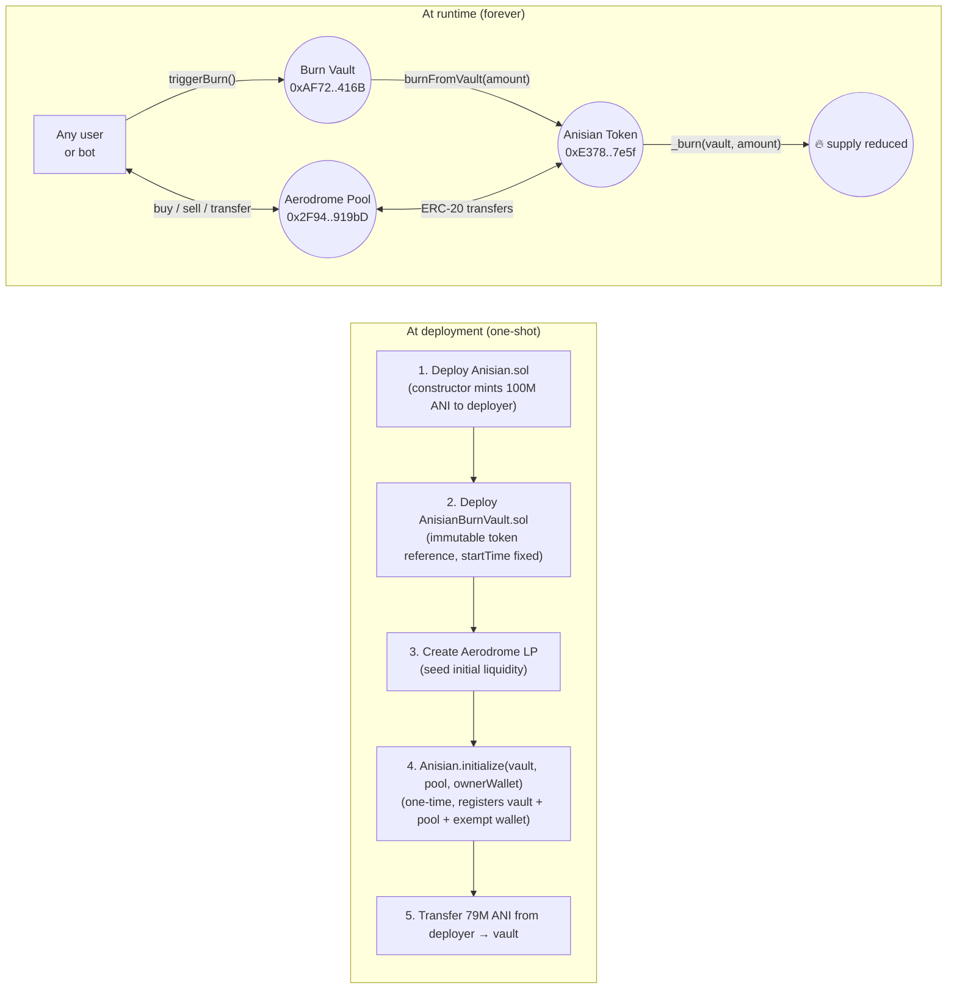

# Architecture

Anisian is a two-contract system on Base mainnet plus a single Aerodrome liquidity pool. There is no other on-chain infrastructure. There is no off-chain admin component. The system is **frozen at deployment**.

## System diagram

## Components

### 1. `Anisian` (ERC-20 token)

The token contract. Inherits from OpenZeppelin's `ERC20` v5.2.0.

**State set in constructor (never changeable):**
- `name = "Anisian"`, `symbol = "ANI"`, `decimals = 18`
- `INITIAL_SUPPLY = 100,000,000 * 10^18` minted to `msg.sender` (deployer)
- `_initializer = msg.sender`

**State set in `initialize()` (one-shot, called by deployer exactly once):**
- `burnVault` — address of the deployed `AnisianBurnVault`
- `isLiquidityPool[pool] = true` for one pool
- `isLimitExempt[vault] = isLimitExempt[ownerWallet] = true`
- `liquidityCreatedAt = block.timestamp`
- `protectionEndsAt = block.timestamp + 90 days`

After `initialize()`, the contract has **no further admin entry points**.

### 2. `AnisianBurnVault`

Holds ANI and burns it on a schedule. Inherits from nothing.

**State set in constructor (immutable):**
- `token` — `IAnisian` interface to the deployed token
- `startTime = block.timestamp` — anchors the entire halving schedule

**Mutable state:**
- `totalBurned` — only ever increases, by exact amounts requested via `triggerBurn()`

There is no admin, no pause, no withdraw, no upgrade.

### 3. Aerodrome liquidity pool

A standard Aerodrome v2 pool (`vAMM-ANI/WETH` or similar). Not custom code. The token contract is informed of this pool's address via `initialize()` so it can apply the 90-day launch protection only to buys from this specific pool.

## Trust model

| Property | Guarantee | Why |
| --- | --- | --- |
| Total supply will never exceed 100M ANI | Hard guarantee | The only `_mint` call is in the constructor; no `mint` function exists. |
| Token supply can only **decrease** | Hard guarantee | `_burn` is only callable through `burnFromVault`, which is only callable by the registered `burnVault`. |
| Burn schedule cannot be accelerated or delayed | Hard guarantee | `startTime`, `HALVING_PERIOD`, and the alloc constants are immutable. `pendingBurn()` is the only thing that can be burned at any moment. |
| Burn vault cannot be drained or rugged | Hard guarantee | Vault has no `transfer`, no `withdraw`, no admin. The only outflow is `_burn` via `triggerBurn`. |
| Liquidity pool cannot be re-pointed | Hard guarantee | `initialize()` can be called only once; `isLiquidityPool` cannot be cleared or extended. |
| Launch buy limits cannot be re-enabled | Hard guarantee | After 90 days, `limitsFinalized` flips to `true` and the limit branch is skipped forever. |
| Anyone can verify the burn schedule | Public read | `burnedTargetAt(t)`, `pendingBurn()`, `vaultBalance()` are public view. |
| Anyone can trigger a scheduled burn | Permissionless | `triggerBurn()` is `external` with no access control. |

## What can the deployer still do?

After `initialize()` is called, the deployer wallet (`0xDc1Dbe909Eb6E9bd054e123747ca77A036F16412`) has **exactly the same powers as any other holder**:

- Send their own ANI to other wallets ✓ (normal ERC-20)
- Receive ANI ✓
- That's it.

The deployer **cannot**:
- Mint new tokens.
- Burn other people's tokens.
- Pause transfers.
- Re-enable launch limits.
- Drain the burn vault.
- Change the burn schedule.
- Upgrade either contract.
- Add a second liquidity pool to the limit-exempt mapping.

## Failure modes & mitigations

| Risk | Mitigation |
| --- | --- |
| Vault under-funded | `triggerBurn()` reverts `NotFunded` until the vault holds ≥ `TOTAL_BURN_BUDGET` (79M). The deployer transferred the 79M at deployment; this is a one-time event. |
| No one calls `triggerBurn()` | The function is permissionless; any user, bot, or keeper service can call it. ANI burned per call: up to `pendingBurn()`. There is no penalty for delay; the schedule "catches up" on the next call. |
| Bug in immutable code | Cannot be patched. Anyone can fork the source (MIT licensed) and redeploy. Holders of the original token are unaffected by forks. |
| OpenZeppelin library changes upstream | The contract imports a specific GitHub tag (`v5.2.0`). The deployed bytecode is what matters, not the live URL; Basescan stores the verified source forever. |

## See also

- [`BURN_SCHEDULE.md`](./BURN_SCHEDULE.md) — exact per-epoch allocations.
- [`FAQ.md`](./FAQ.md) — common questions.
- [`../SECURITY.md`](../SECURITY.md) — security disclosure policy.
- [`../contracts/Anisian.sol`](../contracts/Anisian.sol) — token source (verified on Basescan).
- [`../contracts/AnisianBurnVault.sol`](../contracts/AnisianBurnVault.sol) — vault source (verified on Basescan).
